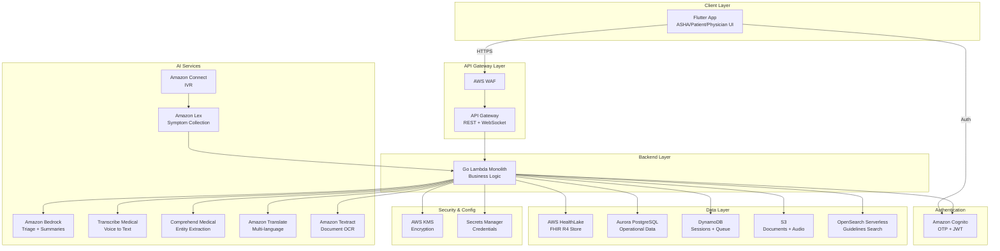
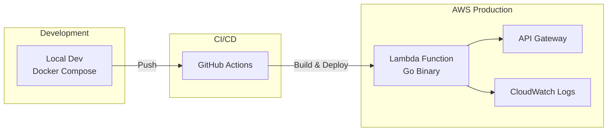
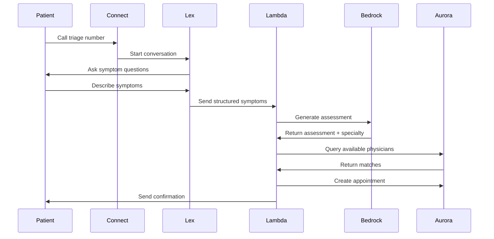
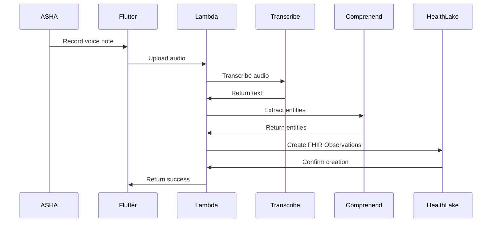
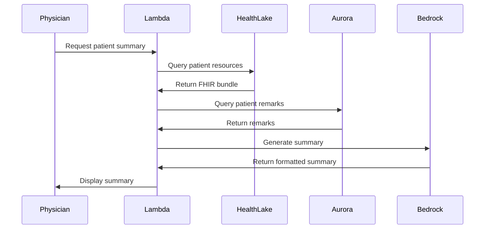

# Design Document: PrathamCare

## Overview

PrathamCare is architected as a Flutter-based monorepo with a Go backend monolith, leveraging AWS managed services for AI capabilities, data storage, and infrastructure. The system follows a clean architecture pattern with clear separation between presentation (Flutter), business logic (Go), and data layers (AWS services).

The architecture prioritizes:
- **Role-based access**: Single app with three distinct user experiences
- **Offline-first**: ASHA workers can capture data without connectivity
- **AI-augmented workflows**: Automated triage, summaries, and entity extraction
- **FHIR compliance**: Standardized healthcare data exchange
- **Serverless deployment**: Lambda-based backend for cost efficiency and scalability

### Key Design Decisions

1. **Monorepo Structure**: Single repository containing Flutter app and Go backend for simplified dependency management and atomic deployments
2. **Go Monolith**: Single Lambda function handling all API routes, avoiding microservices complexity for MVP
3. **FHIR R4 as Source of Truth**: Clinical data stored in AWS HealthLake for interoperability and compliance
4. **Hybrid Storage**: FHIR for clinical data, Aurora for operational data (appointments, schedules), DynamoDB for sessions
5. **AI Service Composition**: Orchestrating multiple AWS AI services (Bedrock, Lex, Transcribe, Comprehend) for end-to-end workflows

## Architecture

### System Context



### Deployment Architecture



## Components and Interfaces

### Frontend Components (Flutter)

#### 1. Authentication Module
- **Responsibility**: Handle OTP-based login and JWT token management
- **Key Classes**:
  - `AuthService`: Manages Cognito integration
  - `AuthProvider` (Riverpod): State management for auth status
  - `LoginScreen`: OTP input UI
- **Dependencies**: Amazon Cognito SDK, Riverpod, Hive (token storage)

#### 2. ASHA Capture Module
- **Responsibility**: Patient data capture with voice/text input and offline support
- **Key Classes**:
  - `PatientCaptureScreen`: Main data entry UI
  - `VoiceInputWidget`: Voice recording and transcription
  - `QRScannerWidget`: ABHA QR code scanning
  - `OfflineSyncService`: Queue and sync offline data
  - `VitalsFormWidget`: Structured vitals input
- **Dependencies**: camera, qr_code_scanner, record, sqflite, Dio

#### 3. Patient Module
- **Responsibility**: Patient-facing features (timeline, remarks, appointments)
- **Key Classes**:
  - `TimelineScreen`: Display medical history
  - `RemarksScreen`: Submit voice/text remarks
  - `AppointmentListScreen`: View upcoming appointments
  - `TriageCallWidget`: Initiate AI triage call
- **Dependencies**: Dio, Riverpod, intl

#### 4. Physician Module
- **Responsibility**: Doctor consultation workflow
- **Key Classes**:
  - `AppointmentDashboard`: Daily appointment list
  - `PatientSummaryScreen`: AI-generated summary view
  - `SOAPNoteEditor`: Dictation and note structuring
  - `PrescriptionGenerator`: Create e-prescriptions
- **Dependencies**: Dio, pdf, printing, record

#### 5. Shared Components
- **Responsibility**: Cross-cutting concerns
- **Key Classes**:
  - `ApiClient`: HTTP client with auth interceptor
  - `LocalStorageService`: Hive wrapper for offline data
  - `ErrorHandler`: Centralized error handling
  - `LanguageProvider`: Multi-language support
- **Dependencies**: Dio, Hive, flutter_localizations

### Backend Components (Go)

#### 1. API Handler Layer
- **Package**: `handlers`
- **Responsibility**: HTTP request handling and response formatting
- **Key Handlers**:
  - `AuthHandler`: Token validation middleware
  - `PatientHandler`: Patient CRUD operations
  - `EncounterHandler`: Encounter and voice note processing
  - `AppointmentHandler`: Appointment management
  - `RemarkHandler`: Patient remark submission
  - `DocumentHandler`: Document upload and retrieval
  - `TriageHandler`: AI triage orchestration
- **Dependencies**: gin/chi, aws-sdk-go-v2

#### 2. Service Layer
- **Package**: `services`
- **Responsibility**: Business logic and orchestration
- **Key Services**:
  - `FHIRService`: HealthLake interactions
  - `TriageService`: AI triage workflow orchestration
  - `SummaryService`: AI summary generation
  - `TranscriptionService`: Voice-to-text processing
  - `EntityExtractionService`: Medical entity extraction
  - `PhysicianMatchingService`: Specialty-based matching
  - `NotificationService`: Multi-channel notifications
- **Dependencies**: AWS SDK v2 (Bedrock, Transcribe, Comprehend, HealthLake)

#### 3. Repository Layer
- **Package**: `repositories`
- **Responsibility**: Data access abstraction
- **Key Repositories**:
  - `FHIRRepository`: HealthLake queries and writes
  - `UserRepository`: Aurora user table access
  - `AppointmentRepository`: Aurora appointment operations
  - `PhysicianRepository`: Physician and schedule queries
  - `RemarkRepository`: Patient remark storage
  - `SessionRepository`: DynamoDB session management
  - `OfflineQueueRepository`: DynamoDB queue operations
  - `DocumentRepository`: S3 document operations
- **Dependencies**: database/sql, aws-sdk-go-v2/service/dynamodb, aws-sdk-go-v2/service/s3

#### 4. Domain Models
- **Package**: `models`
- **Responsibility**: Core business entities
- **Key Models**:
  - `User`: System user with role
  - `Patient`: Patient demographics (maps to FHIR Patient)
  - `Physician`: Physician profile and specialty
  - `Appointment`: Appointment details
  - `Remark`: Patient-submitted remark
  - `TriageRequest`: Triage input data
  - `TriageAssessment`: AI-generated assessment
  - `Summary`: AI-generated patient summary
  - `SOAPNote`: Structured clinical note

#### 5. FHIR Adapters
- **Package**: `fhir`
- **Responsibility**: FHIR resource mapping and validation
- **Key Adapters**:
  - `PatientAdapter`: Convert between domain Patient and FHIR Patient
  - `ObservationAdapter`: Map vitals to FHIR Observations
  - `ConditionAdapter`: Map diagnoses to FHIR Conditions
  - `MedicationRequestAdapter`: Map prescriptions to FHIR MedicationRequests
  - `EncounterAdapter`: Map consultations to FHIR Encounters
  - `DocumentReferenceAdapter`: Map documents to FHIR DocumentReferences

### AI Service Integration

#### 1. Triage Workflow


#### 2. Voice Capture Workflow


#### 3. Summary Generation Workflow


### API Endpoints

#### Authentication
- `POST /auth/send-otp`: Send OTP to phone number
- `POST /auth/verify-otp`: Verify OTP and issue JWT
- `POST /auth/refresh`: Refresh JWT token

#### Patients
- `GET /patients`: List patients (ASHA/Physician only)
- `POST /patients`: Create new patient
- `GET /patients/{id}`: Get patient details
- `PUT /patients/{id}`: Update patient
- `GET /patients/{id}/timeline`: Get patient medical timeline
- `POST /patients/{id}/scan-abha`: Link ABHA to patient

#### Encounters
- `POST /encounters`: Create new encounter
- `GET /encounters/{id}`: Get encounter details
- `POST /encounters/{id}/voice-note`: Upload voice note
- `PUT /encounters/{id}/soap`: Update SOAP note

#### Appointments
- `GET /appointments`: List appointments (filtered by role)
- `POST /appointments`: Create appointment (admin only)
- `GET /appointments/{id}`: Get appointment details
- `PUT /appointments/{id}/status`: Update appointment status
- `GET /appointments/{id}/summary`: Get AI-generated patient summary

#### Remarks
- `POST /patients/{id}/remarks`: Submit patient remark
- `GET /patients/{id}/remarks`: Get patient remarks

#### Documents
- `POST /patients/{id}/documents`: Upload document
- `GET /documents/{id}`: Get document (signed URL)
- `GET /patients/{id}/documents`: List patient documents

#### Triage
- `POST /triage/webhook`: Lex webhook for symptom processing
- `POST /triage/analyze`: Analyze symptoms and generate assessment
- `POST /triage/match`: Match patient to physician

#### Prescriptions
- `POST /encounters/{id}/prescriptions`: Create prescription
- `GET /prescriptions/{id}`: Get prescription details
- `GET /prescriptions/{id}/pdf`: Generate prescription PDF

#### Offline Sync
- `POST /sync/queue`: Upload offline queue batch
- `GET /sync/status`: Check sync status

## Data Models

### Aurora PostgreSQL Schema

```sql
-- Users table
CREATE TABLE users (
    id UUID PRIMARY KEY DEFAULT gen_random_uuid(),
    phone_number VARCHAR(15) UNIQUE NOT NULL,
    role VARCHAR(20) NOT NULL CHECK (role IN ('asha', 'patient', 'physician')),
    cognito_sub VARCHAR(255) UNIQUE NOT NULL,
    preferred_language VARCHAR(10) DEFAULT 'en',
    created_at TIMESTAMP DEFAULT CURRENT_TIMESTAMP,
    updated_at TIMESTAMP DEFAULT CURRENT_TIMESTAMP
);

-- Physicians table
CREATE TABLE physicians (
    id UUID PRIMARY KEY DEFAULT gen_random_uuid(),
    user_id UUID REFERENCES users(id) ON DELETE CASCADE,
    name VARCHAR(255) NOT NULL,
    specialty VARCHAR(100) NOT NULL,
    license_number VARCHAR(50) UNIQUE NOT NULL,
    fhir_practitioner_id VARCHAR(255) UNIQUE,
    created_at TIMESTAMP DEFAULT CURRENT_TIMESTAMP,
    updated_at TIMESTAMP DEFAULT CURRENT_TIMESTAMP
);

-- Physician schedule table
CREATE TABLE physician_schedule (
    id UUID PRIMARY KEY DEFAULT gen_random_uuid(),
    physician_id UUID REFERENCES physicians(id) ON DELETE CASCADE,
    day_of_week INTEGER NOT NULL CHECK (day_of_week BETWEEN 0 AND 6),
    start_time TIME NOT NULL,
    end_time TIME NOT NULL,
    slot_duration_minutes INTEGER DEFAULT 30,
    is_available BOOLEAN DEFAULT true,
    created_at TIMESTAMP DEFAULT CURRENT_TIMESTAMP,
    UNIQUE(physician_id, day_of_week, start_time)
);

-- Appointments table
CREATE TABLE appointments (
    id UUID PRIMARY KEY DEFAULT gen_random_uuid(),
    patient_fhir_id VARCHAR(255) NOT NULL,
    physician_id UUID REFERENCES physicians(id) ON DELETE CASCADE,
    scheduled_at TIMESTAMP NOT NULL,
    duration_minutes INTEGER DEFAULT 30,
    status VARCHAR(20) DEFAULT 'scheduled' CHECK (status IN ('scheduled', 'completed', 'cancelled', 'no_show')),
    triage_assessment_id VARCHAR(255),
    created_by VARCHAR(20) CHECK (created_by IN ('system', 'patient', 'physician', 'asha')),
    created_at TIMESTAMP DEFAULT CURRENT_TIMESTAMP,
    updated_at TIMESTAMP DEFAULT CURRENT_TIMESTAMP
);

-- Patient remarks table
CREATE TABLE patient_remarks (
    id UUID PRIMARY KEY DEFAULT gen_random_uuid(),
    patient_fhir_id VARCHAR(255) NOT NULL,
    remark_text TEXT NOT NULL,
    original_language VARCHAR(10),
    translated_text TEXT,
    urgency_level VARCHAR(20) CHECK (urgency_level IN ('low', 'medium', 'high', 'critical')),
    category VARCHAR(50),
    audio_s3_key VARCHAR(500),
    created_at TIMESTAMP DEFAULT CURRENT_TIMESTAMP,
    INDEX idx_patient_remarks (patient_fhir_id, created_at DESC)
);

-- Waitlist table
CREATE TABLE waitlist (
    id UUID PRIMARY KEY DEFAULT gen_random_uuid(),
    patient_fhir_id VARCHAR(255) NOT NULL,
    specialty VARCHAR(100) NOT NULL,
    triage_assessment_id VARCHAR(255),
    priority INTEGER DEFAULT 0,
    status VARCHAR(20) DEFAULT 'waiting' CHECK (status IN ('waiting', 'booked', 'expired')),
    created_at TIMESTAMP DEFAULT CURRENT_TIMESTAMP,
    INDEX idx_waitlist_specialty (specialty, priority DESC, created_at)
);
```

### DynamoDB Tables

#### Sessions Table
```json
{
  "TableName": "prathamcare-sessions",
  "KeySchema": [
    {"AttributeName": "session_id", "KeyType": "HASH"}
  ],
  "AttributeDefinitions": [
    {"AttributeName": "session_id", "AttributeType": "S"},
    {"AttributeName": "user_id", "AttributeType": "S"}
  ],
  "GlobalSecondaryIndexes": [
    {
      "IndexName": "user-index",
      "KeySchema": [{"AttributeName": "user_id", "KeyType": "HASH"}]
    }
  ],
  "TimeToLiveSpecification": {
    "Enabled": true,
    "AttributeName": "ttl"
  }
}
```

#### Offline Queue Table
```json
{
  "TableName": "prathamcare-offline-queue",
  "KeySchema": [
    {"AttributeName": "user_id", "KeyType": "HASH"},
    {"AttributeName": "timestamp", "KeyType": "RANGE"}
  ],
  "AttributeDefinitions": [
    {"AttributeName": "user_id", "AttributeType": "S"},
    {"AttributeName": "timestamp", "AttributeType": "N"},
    {"AttributeName": "sync_status", "AttributeType": "S"}
  ],
  "GlobalSecondaryIndexes": [
    {
      "IndexName": "sync-status-index",
      "KeySchema": [
        {"AttributeName": "sync_status", "KeyType": "HASH"},
        {"AttributeName": "timestamp", "KeyType": "RANGE"}
      ]
    }
  ]
}
```

### FHIR Resources (HealthLake)

#### Patient Resource
```json
{
  "resourceType": "Patient",
  "identifier": [
    {
      "system": "https://ndhm.gov.in/abha",
      "value": "12-3456-7890-1234"
    }
  ],
  "name": [
    {
      "use": "official",
      "family": "Sharma",
      "given": ["Rajesh"]
    }
  ],
  "telecom": [
    {
      "system": "phone",
      "value": "+919876543210"
    }
  ],
  "gender": "male",
  "birthDate": "1985-06-15",
  "address": [
    {
      "use": "home",
      "city": "Mumbai",
      "state": "Maharashtra",
      "postalCode": "400001",
      "country": "IN"
    }
  ]
}
```

#### Observation Resource (Vitals)
```json
{
  "resourceType": "Observation",
  "status": "final",
  "category": [
    {
      "coding": [
        {
          "system": "http://terminology.hl7.org/CodeSystem/observation-category",
          "code": "vital-signs"
        }
      ]
    }
  ],
  "code": {
    "coding": [
      {
        "system": "http://loinc.org",
        "code": "85354-9",
        "display": "Blood pressure"
      }
    ]
  },
  "subject": {
    "reference": "Patient/patient-id"
  },
  "effectiveDateTime": "2024-01-15T10:30:00Z",
  "component": [
    {
      "code": {
        "coding": [
          {
            "system": "http://loinc.org",
            "code": "8480-6",
            "display": "Systolic blood pressure"
          }
        ]
      },
      "valueQuantity": {
        "value": 120,
        "unit": "mmHg"
      }
    },
    {
      "code": {
        "coding": [
          {
            "system": "http://loinc.org",
            "code": "8462-4",
            "display": "Diastolic blood pressure"
          }
        ]
      },
      "valueQuantity": {
        "value": 80,
        "unit": "mmHg"
      }
    }
  ]
}
```

#### Condition Resource
```json
{
  "resourceType": "Condition",
  "clinicalStatus": {
    "coding": [
      {
        "system": "http://terminology.hl7.org/CodeSystem/condition-clinical",
        "code": "active"
      }
    ]
  },
  "verificationStatus": {
    "coding": [
      {
        "system": "http://terminology.hl7.org/CodeSystem/condition-ver-status",
        "code": "confirmed"
      }
    ]
  },
  "category": [
    {
      "coding": [
        {
          "system": "http://terminology.hl7.org/CodeSystem/condition-category",
          "code": "encounter-diagnosis"
        }
      ]
    }
  ],
  "code": {
    "coding": [
      {
        "system": "http://snomed.info/sct",
        "code": "73211009",
        "display": "Diabetes mellitus"
      }
    ]
  },
  "subject": {
    "reference": "Patient/patient-id"
  },
  "onsetDateTime": "2023-06-01"
}
```

#### MedicationRequest Resource
```json
{
  "resourceType": "MedicationRequest",
  "status": "active",
  "intent": "order",
  "medicationCodeableConcept": {
    "coding": [
      {
        "system": "http://www.nlm.nih.gov/research/umls/rxnorm",
        "code": "860975",
        "display": "Metformin 500 MG Oral Tablet"
      }
    ],
    "text": "Metformin 500mg"
  },
  "subject": {
    "reference": "Patient/patient-id"
  },
  "authoredOn": "2024-01-15T14:30:00Z",
  "requester": {
    "reference": "Practitioner/physician-id"
  },
  "dosageInstruction": [
    {
      "text": "Take 1 tablet twice daily with meals",
      "timing": {
        "repeat": {
          "frequency": 2,
          "period": 1,
          "periodUnit": "d"
        }
      },
      "doseAndRate": [
        {
          "doseQuantity": {
            "value": 1,
            "unit": "tablet"
          }
        }
      ]
    }
  ],
  "dispenseRequest": {
    "validityPeriod": {
      "start": "2024-01-15",
      "end": "2024-04-15"
    },
    "quantity": {
      "value": 180,
      "unit": "tablet"
    }
  }
}
```

### S3 Bucket Structure

```
medical-documents/
  ├── patients/
  │   └── {patient-fhir-id}/
  │       ├── lab-reports/
  │       │   └── {document-id}.pdf
  │       ├── prescriptions/
  │       │   └── {prescription-id}.pdf
  │       └── images/
  │           └── {image-id}.jpg
  └── voice-recordings/
      └── {patient-fhir-id}/
          ├── vitals/
          │   └── {recording-id}.wav
          ├── remarks/
          │   └── {remark-id}.wav
          └── soap-notes/
              └── {encounter-id}.wav
```


## Correctness Properties

*A property is a characteristic or behavior that should hold true across all valid executions of a system—essentially, a formal statement about what the system should do. Properties serve as the bridge between human-readable specifications and machine-verifiable correctness guarantees.*

### Property Reflection

After analyzing all acceptance criteria, I've identified several areas where properties can be consolidated:

- **Transcription properties** (2.2, 6.1, 7.1, 17.2): All test the same transcription service behavior - can be unified
- **Translation properties** (3.3, 7.2, 12.4): All test translation from regional languages to English - can be unified
- **FHIR resource creation** (2.3, 6.3, 6.5, 9.3, 16.1): Multiple properties test FHIR resource creation - can be grouped by resource type
- **Authorization properties** (1.4, 1.5, 1.6): All test role-based access - can be unified into one comprehensive property
- **Notification properties** (19.1, 19.3, 19.4, 19.5): All test notification delivery - can be unified
- **Summary inclusion properties** (5.4, 7.6, 9.6, 15.3): All test that summaries include specific data - can be consolidated

### Core Properties

#### Property 1: JWT Token Validation
*For any* JWT token presented to the Backend_API, the system should validate the token signature and expiration, accepting valid tokens and rejecting invalid or expired tokens.
**Validates: Requirements 1.3, 1.7**

#### Property 2: Role-Based Access Control
*For any* authenticated user and API endpoint, the system should grant access if and only if the user's role has permission for that endpoint (ASHA for patient capture, Patient for triage/appointments/remarks, Physician for appointments/summaries/prescriptions).
**Validates: Requirements 1.4, 1.5, 1.6, 13.3**

#### Property 3: Voice Transcription Accuracy
*For any* audio recording containing speech, the Voice_Transcription_Service should produce text output that can be verified for medical vocabulary accuracy.
**Validates: Requirements 2.2, 6.1, 7.1, 17.2**

#### Property 4: Medical Entity Extraction to FHIR
*For any* transcribed text containing medical entities (vitals, symptoms, diagnoses), the system should extract structured data and create valid FHIR resources of the appropriate type (Observation for vitals, Condition for diagnoses, MedicationRequest for prescriptions).
**Validates: Requirements 2.3, 6.4, 17.5, 17.6**

#### Property 5: Offline Queue and Sync
*For any* data captured while offline, the system should store it in the Offline_Queue with a timestamp, and when connectivity is restored, sync the data to FHIR_Store in chronological order, removing successfully synced items from the queue.
**Validates: Requirements 2.4, 2.5, 10.2, 10.3, 10.4, 10.5, 10.6**

#### Property 6: ABHA QR Code Processing
*For any* valid ABHA QR code, the QR_Scanner should extract the ABHA identifier, validate its format, and either link to an existing patient record or create a new one without duplicates.
**Validates: Requirements 2.6, 4.1, 4.2, 4.3, 4.4**

#### Property 7: Document Upload to FHIR
*For any* valid document upload (within size/type limits), the system should store it in S3 with a unique identifier, create a FHIR DocumentReference resource linking to the S3 object, and generate a time-limited signed URL for access.
**Validates: Requirements 2.7, 9.2, 9.3, 9.7**

#### Property 8: Multi-Language Translation
*For any* text input in Hindi or regional languages, the system should translate it to English for processing, and translate AI-generated English responses back to the user's preferred language.
**Validates: Requirements 3.3, 7.2, 12.4, 12.5**

#### Property 9: AI Triage Assessment Generation
*For any* structured symptom data from the Symptom_Collector, the AI_Triage_Engine should generate an assessment containing an urgency level and recommended specialty.
**Validates: Requirements 3.5**

#### Property 10: Physician Matching and Appointment Creation
*For any* triage assessment with a recommended specialty, the system should query for available physicians matching that specialty, rank them by earliest available slot, create an appointment with the best match, and mark the time slot as booked.
**Validates: Requirements 3.6, 3.7, 11.1, 11.2, 11.3, 11.4, 11.5**

#### Property 11: Notification Delivery
*For any* event that requires notification (appointment creation, prescription issuance, urgent remark, appointment cancellation), the system should send notifications to the appropriate recipients using their preferred channel, with retry logic for failures.
**Validates: Requirements 3.8, 19.1, 19.3, 19.4, 19.5, 19.6, 19.7**

#### Property 12: Patient Timeline Chronological Ordering
*For any* patient's FHIR resources, when retrieved for timeline display, the system should sort them chronologically by date and group them by encounter or date.
**Validates: Requirements 8.2, 8.3**

#### Property 13: AI Summary Completeness
*For any* patient with FHIR resources, when generating a summary, the system should include all required clinical categories (recent vitals, active conditions, medications, allergies, family history, patient remarks with urgency indicators), prioritize active conditions, show vital trends when sufficient data exists, and include source citations.
**Validates: Requirements 5.4, 5.5, 5.6, 15.2, 15.3, 15.5, 15.6, 15.7**

#### Property 14: AI Summary Time Constraint
*For any* generated patient summary, the content should fit within a 2-minute reading time (approximately 300-400 words).
**Validates: Requirements 15.4**

#### Property 15: SOAP Note Structuring
*For any* transcribed clinical dictation, the system should structure the content into SOAP note format with four sections: Subjective, Objective, Assessment, and Plan.
**Validates: Requirements 6.2**

#### Property 16: Prescription FHIR Resource Completeness
*For any* prescription created by a physician, the system should create a FHIR MedicationRequest resource containing drug name, dosage, frequency, duration, and instructions, and make it available in the patient's timeline.
**Validates: Requirements 6.5, 16.1, 16.2, 16.7**

#### Property 17: Prescription PDF Generation
*For any* finalized prescription, the system should generate a PDF containing physician details, patient details, medication list, and a digital signature or verification code.
**Validates: Requirements 6.6, 16.3, 16.4**

#### Property 18: Drug Interaction Detection
*For any* new prescription, the system should check for drug-drug interactions with the patient's existing medications and detect potential interactions.
**Validates: Requirements 16.5**

#### Property 19: Patient Remark Categorization
*For any* patient remark (voice or text), the system should transcribe it (if voice), translate it (if non-English), analyze it to assign an urgency level and clinical relevance category, and store it associated with the patient record.
**Validates: Requirements 7.3, 7.4, 7.5**

#### Property 20: Medical Entity Extraction from Remarks
*For any* patient remark containing medical entities, the system should extract and highlight them in the physician view.
**Validates: Requirements 7.7**

#### Property 21: Document OCR and Entity Extraction
*For any* uploaded document that is an image or PDF, the system should extract text using OCR, analyze it for medical entities, and store structured data.
**Validates: Requirements 9.4, 9.5**

#### Property 22: File Upload Validation
*For any* file upload attempt, the system should validate the file type and size, accepting valid files and rejecting invalid ones.
**Validates: Requirements 9.1**

#### Property 23: Retry with Exponential Backoff
*For any* failed Backend_API call due to network timeout or AWS throttling, the system should retry the request with exponentially increasing delays until a retry limit is reached.
**Validates: Requirements 10.7, 14.1, 14.3**

#### Property 24: Error Logging
*For any* critical error or failed operation, the system should log detailed error information including timestamp, user identifier, operation type, and error details.
**Validates: Requirements 13.4, 14.6**

#### Property 25: Input Validation and Sanitization
*For any* user input received by the system, the system should validate and sanitize it before processing to prevent injection attacks and data corruption.
**Validates: Requirements 14.7**

#### Property 26: FHIR Resource Retrieval Scope
*For any* patient summary generation request, the system should retrieve all FHIR resources for that patient from the past 12 months.
**Validates: Requirements 15.1**

#### Property 27: Patient Search Authorization
*For any* patient search query by a physician, the system should only return patients the physician is authorized to view based on their relationship.
**Validates: Requirements 18.5**

#### Property 28: Search Result Ranking
*For any* search query (patient or guideline), the system should rank results by relevance and return them in descending order of relevance score.
**Validates: Requirements 18.3**

#### Property 29: Medical Term Query Expansion
*For any* search query containing medical terms, the system should expand it with synonyms to improve recall.
**Validates: Requirements 18.6**

#### Property 30: Appointment Reminder Scheduling
*For any* appointment that is within 24 hours, the system should send a reminder notification to both patient and physician.
**Validates: Requirements 19.2**

#### Property 31: Language Preference Persistence
*For any* user who selects a language preference, the system should store it in their user profile and use it for all subsequent interactions.
**Validates: Requirements 12.1**

#### Property 32: Dual Language Display for Remarks
*For any* patient remark in a non-English language, when viewed by a physician, the system should display both the original text and the translated English version.
**Validates: Requirements 12.7**

#### Property 33: Configuration from Environment Variables
*For any* configuration parameter (database connection, AWS credentials, feature flags, log levels), the system should read it from environment variables, failing to start if required variables are missing.
**Validates: Requirements 20.4, 20.5, 20.6**

#### Property 34: Data Deletion on Request
*For any* patient data deletion request, the system should anonymize or remove the patient's data from all storage systems (FHIR_Store, Aurora, DynamoDB, S3) in compliance with GDPR/DPDPA requirements.
**Validates: Requirements 13.7**

#### Property 35: Waitlist Processing on Availability Change
*For any* physician availability change (cancellation or addition), the system should check the waitlist for matching specialty and automatically book waiting patients in priority order.
**Validates: Requirements 11.7**

## Error Handling

### Error Categories

#### 1. Authentication Errors
- **Invalid OTP**: Return 401 with message "Invalid or expired OTP"
- **Expired JWT**: Return 401 with message "Token expired, please login again"
- **Invalid JWT Signature**: Return 401 with message "Invalid authentication token"
- **Missing Authorization Header**: Return 401 with message "Authorization required"

#### 2. Authorization Errors
- **Insufficient Permissions**: Return 403 with message "You don't have permission to access this resource"
- **Patient Access Violation**: Return 403 with message "You are not authorized to view this patient's data"

#### 3. Validation Errors
- **Invalid ABHA Format**: Return 400 with message "Invalid ABHA identifier format"
- **Invalid File Type**: Return 400 with message "File type not supported. Allowed: PDF, JPG, PNG"
- **File Too Large**: Return 400 with message "File size exceeds 10MB limit"
- **Missing Required Fields**: Return 400 with detailed field-level errors
- **Invalid FHIR Resource**: Return 400 with FHIR validation errors

#### 4. Business Logic Errors
- **No Available Physicians**: Return 404 with message "No physicians available for this specialty" and add to waitlist
- **Duplicate ABHA**: Return 409 with message "Patient with this ABHA already exists" and return existing patient ID
- **Appointment Slot Taken**: Return 409 with message "This time slot is no longer available"
- **Drug Interaction Detected**: Return 200 with warning in response body (not an error, but requires physician acknowledgment)

#### 5. External Service Errors
- **Transcribe Service Failure**: Retry 3 times with exponential backoff, then return 503 with message "Voice transcription temporarily unavailable"
- **Bedrock Service Failure**: Retry 3 times, then return 503 with message "AI service temporarily unavailable"
- **HealthLake Unavailable**: Queue write operations, return 202 with message "Request queued for processing"
- **S3 Upload Failure**: Retry 3 times, then return 503 with message "Document upload failed, please try again"

#### 6. Network and Timeout Errors
- **Request Timeout**: Retry with exponential backoff (1s, 2s, 4s), max 3 retries
- **Connection Refused**: Return 503 with message "Service temporarily unavailable"
- **DNS Resolution Failure**: Return 503 with message "Unable to connect to service"

#### 7. Data Errors
- **Patient Not Found**: Return 404 with message "Patient not found"
- **Appointment Not Found**: Return 404 with message "Appointment not found"
- **Document Not Found**: Return 404 with message "Document not found"
- **FHIR Resource Not Found**: Return 404 with message "Resource not found in health records"

### Error Response Format

All errors follow a consistent JSON structure:

```json
{
  "error": {
    "code": "ERROR_CODE",
    "message": "Human-readable error message",
    "details": {
      "field": "specific field that caused error",
      "value": "invalid value",
      "constraint": "validation rule that failed"
    },
    "timestamp": "2024-01-15T10:30:00Z",
    "request_id": "uuid-for-tracing"
  }
}
```

### Retry Strategy

```go
type RetryConfig struct {
    MaxRetries      int
    InitialDelay    time.Duration
    MaxDelay        time.Duration
    Multiplier      float64
    RetryableErrors []string
}

// Default configuration
var DefaultRetryConfig = RetryConfig{
    MaxRetries:   3,
    InitialDelay: 1 * time.Second,
    MaxDelay:     30 * time.Second,
    Multiplier:   2.0,
    RetryableErrors: []string{
        "RequestTimeout",
        "ServiceUnavailable",
        "ThrottlingException",
        "TooManyRequestsException",
    },
}
```

### Circuit Breaker Pattern

For external service calls (AWS AI services), implement circuit breaker:

```go
type CircuitBreaker struct {
    FailureThreshold int           // Open circuit after N failures
    SuccessThreshold int           // Close circuit after N successes
    Timeout          time.Duration // Time to wait before retry
    State            string        // "closed", "open", "half-open"
}

// Default configuration
var DefaultCircuitBreaker = CircuitBreaker{
    FailureThreshold: 5,
    SuccessThreshold: 2,
    Timeout:          60 * time.Second,
    State:            "closed",
}
```

### Offline Error Handling

When the Flutter app detects offline mode:

1. **Queue Operations**: Store all write operations in local SQLite database
2. **Show Offline Indicator**: Display banner "Working offline - data will sync when connected"
3. **Disable Read-Only Features**: Disable features that require server data (search, AI summaries)
4. **Enable Local Features**: Allow data capture, voice recording, document capture
5. **Sync on Reconnect**: Automatically sync queued operations when connectivity restored

### Logging Strategy

```go
type LogEntry struct {
    Level      string    // "DEBUG", "INFO", "WARN", "ERROR", "FATAL"
    Timestamp  time.Time
    RequestID  string
    UserID     string
    Operation  string
    Message    string
    Error      error
    Metadata   map[string]interface{}
}
```

**Log Levels**:
- **DEBUG**: Detailed diagnostic information (disabled in production)
- **INFO**: General informational messages (API calls, successful operations)
- **WARN**: Warning messages (retry attempts, degraded performance)
- **ERROR**: Error messages (failed operations, validation errors)
- **FATAL**: Critical errors requiring immediate attention (startup failures)

**Sensitive Data Handling**:
- Never log patient names, ABHA identifiers, or medical data
- Log only patient FHIR IDs (UUIDs)
- Redact phone numbers in logs
- Never log JWT tokens or credentials

## Testing Strategy

### Dual Testing Approach

PrathamCare requires both unit testing and property-based testing for comprehensive coverage:

- **Unit Tests**: Verify specific examples, edge cases, and error conditions
- **Property Tests**: Verify universal properties across all inputs using randomized test data

Both approaches are complementary and necessary. Unit tests catch concrete bugs in specific scenarios, while property tests verify general correctness across a wide range of inputs.

### Property-Based Testing Configuration

**Library Selection**:
- **Go Backend**: Use `gopter` (Go property testing library)
- **Flutter Frontend**: Use `test` package with custom property test helpers

**Test Configuration**:
- Minimum 100 iterations per property test (due to randomization)
- Each property test must reference its design document property
- Tag format: `// Feature: prathamcare, Property {number}: {property_text}`

**Example Property Test Structure** (Go):

```go
// Feature: prathamcare, Property 1: JWT Token Validation
func TestProperty_JWTTokenValidation(t *testing.T) {
    parameters := gopter.DefaultTestParameters()
    parameters.MinSuccessfulTests = 100
    
    properties := gopter.NewProperties(parameters)
    
    properties.Property("Valid tokens are accepted, invalid tokens are rejected", 
        prop.ForAll(
            func(token string, isValid bool) bool {
                result := validateJWT(token)
                if isValid {
                    return result.Valid == true
                } else {
                    return result.Valid == false
                }
            },
            genJWTToken(), // Generator for JWT tokens
            gen.Bool(),    // Generator for validity flag
        ))
    
    properties.TestingRun(t)
}
```

### Unit Testing Strategy

**Backend Unit Tests** (Go):
- Test each handler function with specific inputs
- Test service layer business logic
- Test repository layer data access
- Test FHIR adapters for resource mapping
- Mock external dependencies (AWS services, database)

**Frontend Unit Tests** (Flutter):
- Test widget rendering with specific states
- Test state management (Riverpod providers)
- Test API client with mocked responses
- Test offline sync logic
- Test form validation

**Coverage Targets**:
- Backend: 80% code coverage minimum
- Frontend: 70% code coverage minimum
- Critical paths (auth, triage, prescriptions): 90% coverage

### Integration Testing

**API Integration Tests**:
- Test complete API workflows end-to-end
- Use test database and test AWS resources
- Test authentication flow (OTP → JWT → API call)
- Test ASHA capture workflow (voice → transcribe → FHIR)
- Test triage workflow (Lex → Bedrock → appointment)
- Test physician workflow (summary → SOAP → prescription)

**AWS Service Integration Tests**:
- Test Transcribe Medical with sample audio files
- Test Bedrock with sample symptom data
- Test HealthLake FHIR operations
- Test S3 document upload/download
- Test Cognito authentication

### End-to-End Testing

**User Journey Tests** (Flutter integration tests):
1. **ASHA Journey**: Login → Select patient → Capture vitals via voice → Upload document → Verify FHIR resources created
2. **Patient Journey**: Login → View timeline → Add remark → Verify remark stored and categorized
3. **Physician Journey**: Login → View appointments → Review summary → Dictate SOAP note → Issue prescription → Verify PDF generated

### Test Data Management

**Test FHIR Resources**:
- Create sample Patient, Practitioner, Observation, Condition resources
- Use synthetic data (no real patient information)
- Store test resources in separate HealthLake datastore

**Test Users**:
- Create test users for each role (ASHA, Patient, Physician)
- Use test phone numbers (e.g., +919999999999)
- Store in separate test database

**Test Audio Files**:
- Record sample audio for transcription testing
- Include Hindi and English samples
- Include clear and noisy audio samples

### Performance Testing

**Load Testing**:
- Simulate 100 concurrent users
- Test API response times under load
- Test Lambda cold start times
- Test HealthLake query performance

**Stress Testing**:
- Test system behavior at 2x expected load
- Test graceful degradation
- Test circuit breaker activation

**Performance Targets**:
- API response time: < 500ms (p95)
- Voice transcription: < 5 seconds for 1-minute audio
- AI summary generation: < 10 seconds
- Document upload: < 3 seconds for 5MB file

### Security Testing

**Authentication Testing**:
- Test OTP expiration (5 minutes)
- Test JWT expiration (24 hours)
- Test token refresh flow
- Test invalid token rejection

**Authorization Testing**:
- Test role-based access control
- Test cross-patient access prevention
- Test privilege escalation prevention

**Input Validation Testing**:
- Test SQL injection prevention
- Test XSS prevention
- Test file upload validation
- Test FHIR resource validation

### Monitoring and Observability

**Metrics to Track**:
- API request count and latency
- Error rate by endpoint
- AWS service call count and latency
- Database query performance
- Lambda invocation count and duration
- S3 upload/download metrics

**Alarms**:
- API error rate > 5%
- API latency p95 > 1 second
- Lambda errors > 10 per minute
- HealthLake throttling errors
- S3 upload failures

**Dashboards**:
- Real-time API metrics
- User activity by role
- AI service usage and costs
- Database performance
- Error trends

### Test Execution Plan

**Pre-commit**:
- Run unit tests
- Run linters and formatters
- Run security scanners

**CI Pipeline**:
- Run all unit tests
- Run property-based tests
- Run integration tests
- Generate coverage reports
- Build and package artifacts

**Pre-deployment**:
- Run end-to-end tests
- Run performance tests
- Run security tests
- Verify test coverage thresholds

**Post-deployment**:
- Run smoke tests
- Monitor error rates
- Monitor performance metrics
- Verify critical user journeys

